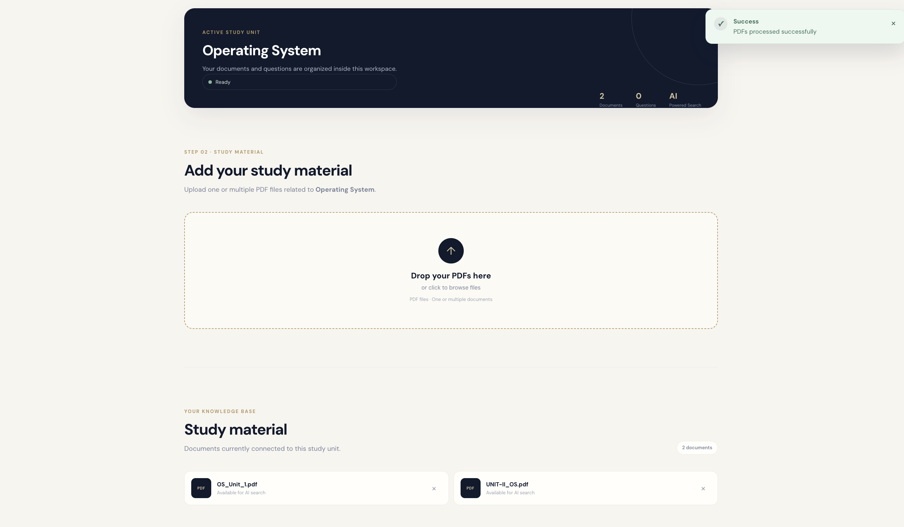
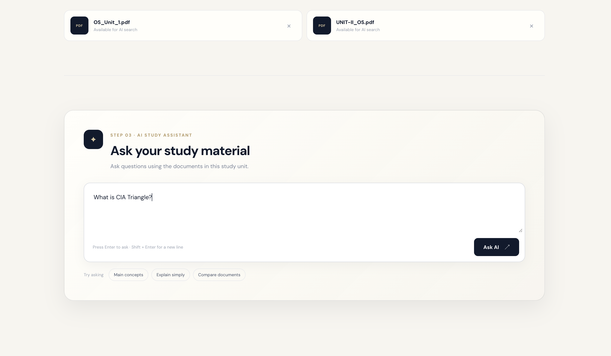
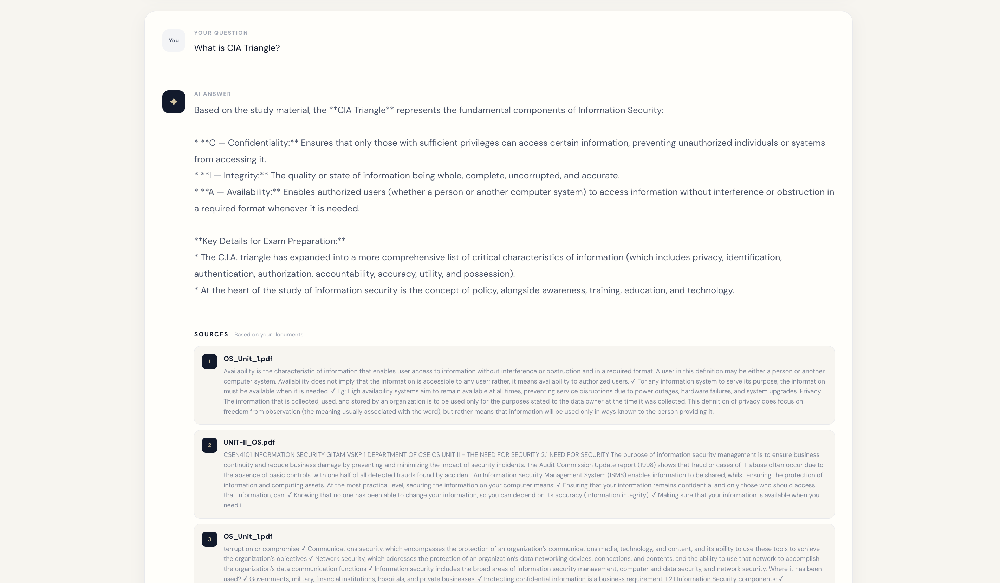

# Research & Study Intelligence

Research & Study Intelligence is a full-stack AI-powered study assistant that allows students to upload multiple PDF documents, organize them into study units, and ask questions based on their uploaded study material.

The application uses a Retrieval-Augmented Generation (RAG) pipeline to retrieve relevant content from the uploaded documents and provide answers grounded in that content.

---

## Overview

Students often need to study the same topic using multiple sources such as:

- Class notes
- Faculty notes
- Reference books
- Study materials
- Previous academic documents

Instead of manually searching through multiple PDFs, Research & Study Intelligence allows users to upload these documents into a study unit and ask questions about them.

For example:

```text
Operating Systems — Unit 1
│
├── OS Notes.pdf
├── Faculty Notes.pdf
└── Reference Book.pdf


## ✨ Features

- Create and manage study units per subject/topic
- Upload single or multiple PDFs per study unit
- Automatic text extraction, chunking, and embedding generation
- Semantic vector search scoped to the selected study unit
- AI-generated answers via Google Gemini, with source chunks and similarity scores shown

## 🧠 How It Works (RAG Pipeline)

PDF Upload → Extract Text → Chunk → Generate Embeddings → Store in MongoDB
│
Question → Embed Question → Vector Search (filtered by studyUnitId) → Top Chunks → Gemini → Answer + Sources


## 🛠️ Tech Stack

- **Frontend:** React, Vite
- **Backend:** Node.js, Express.js, Multer
- **Database:** MongoDB Atlas + Atlas Vector Search
- **AI:** Google Gemini API (embeddings + answer generation)

## 📂 Project Structure

Research-and-Study-Intelligence/
├── client/ # React frontend
├── server/
│ ├── models/ # Chunk, Document, StudyUnit
│ ├── routes/ # study-units, documents, search
│ ├── services/ # pdf, chunk, embedding, answer
│ ├── server.js
│ └── .env
└── README.md


## 🌐 API Endpoints

| Method | Endpoint | Description |
|---|---|---|
| POST | `/api/study-units` | Create a study unit |
| GET | `/api/study-units` | List study units |
| POST | `/api/documents/upload` | Upload PDF(s) (`multipart/form-data`: `studyUnitId`, `files`) |
| GET | `/api/documents?studyUnitId=` | List documents in a study unit |
| DELETE | `/api/documents?studyUnitId=&filename=` | Delete a document |
| POST | `/api/search` | Ask a question (`{ question, studyUnitId }`) |

**Example search response:**

```json
{
  "answer": "A process is a program that is currently in execution.",
  "sources": [
    { "text": "A process is a program in execution...", "filename": "OS Notes.pdf", "score": 0.89 }
  ]
}
```

## 🔐 Environment Variables

Create `server/.env`:

PORT=5001
MONGODB_URI=your_mongodb_connection_string
GEMINI_API_KEY=your_gemini_api_key


## ⚙️ Setup & Run

```bash
# Clone
git clone https://github.com/gowthamrajana/Research-and-Study-Intelligence.git
cd Research-and-Study-Intelligence

# Backend
cd server
npm install
node server.js        # runs on http://localhost:5001

# Frontend (new terminal)
cd client
npm install
npm run dev            # runs on http://localhost:5173
```
## Screenshots

### Dashboard


### Create Study Unit


### Study Unit and Documents



### Ask a Question



### AI Answer and Sources




## 🚀 Future Improvements

- User authentication & per-user study units
- Streaming AI responses
- OCR for scanned PDFs
- Support for DOCX/TXT files
- Quiz/flashcard generation from study material

## 👨‍💻 Author

**Gowtham Rajana** — [GitHub](https://github.com/gowthamrajana)